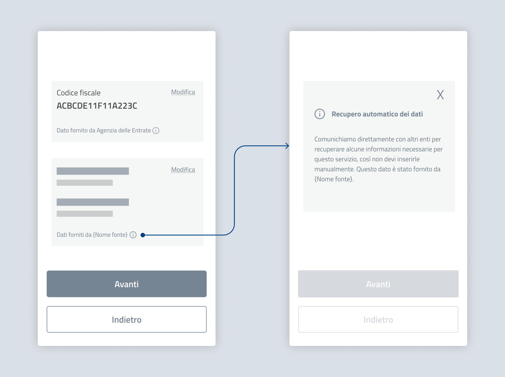

Dati precompilati
===========================================

Durante la procedura, segnala al cittadino quali dati sono recuperati tramite interoperabilità, indicandone la fonte (`vai all’approfondimento: come indicare la fonte dei dati <../approfondimento-indicare-fonte-e-rettifica>`_).

Quando possibile, permetti anche agli utenti di approfondire come funziona il recupero automatico dei dati, ad esempio tramite tooltip, modale o accordion: potrebbero non ricordare il testo dell'informativa privacy e voler capire perché alcuni dati sono già precompilati.

   *Esempio di form precompilati con dati recuperati tramite interoperabilità.*

.. admonition:: Testo suggerito per indicare la fonte

   Dati forniti da {Nome fonte}

.. admonition:: Testo suggerito per spiegazione di approfondimento

   **Recupero automatico dei dati**  

   Comunichiamo direttamente con altri enti per recuperare alcune informazioni necessarie per questo servizio, così non devi inserirle manualmente. Questo dato è stato fornito da {Nome fonte}. 
