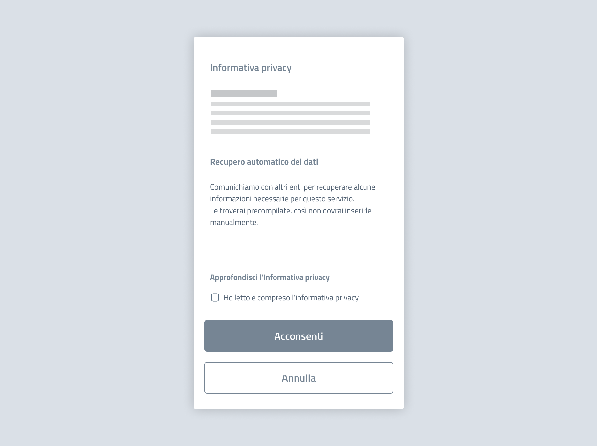

Avvio della procedura: informativa privacy 
===========================================

Prima dell’inizio della procedura, come parte dell’informativa privacy, informa il cittadino che alcuni dati necessari per il servizio verranno recuperati automaticamente, comunicandone brevemente i benefici. 

   *Esempio di informativa privacy prima dell'accesso a un servizio.*

.. admonition:: Testo suggerito

   **Recupero automatico dei dati**

   Comunichiamo con altri enti per recuperare alcune informazioni necessarie per questo servizio. Le troverai precompilate, così non dovrai inserirle manualmente. 
