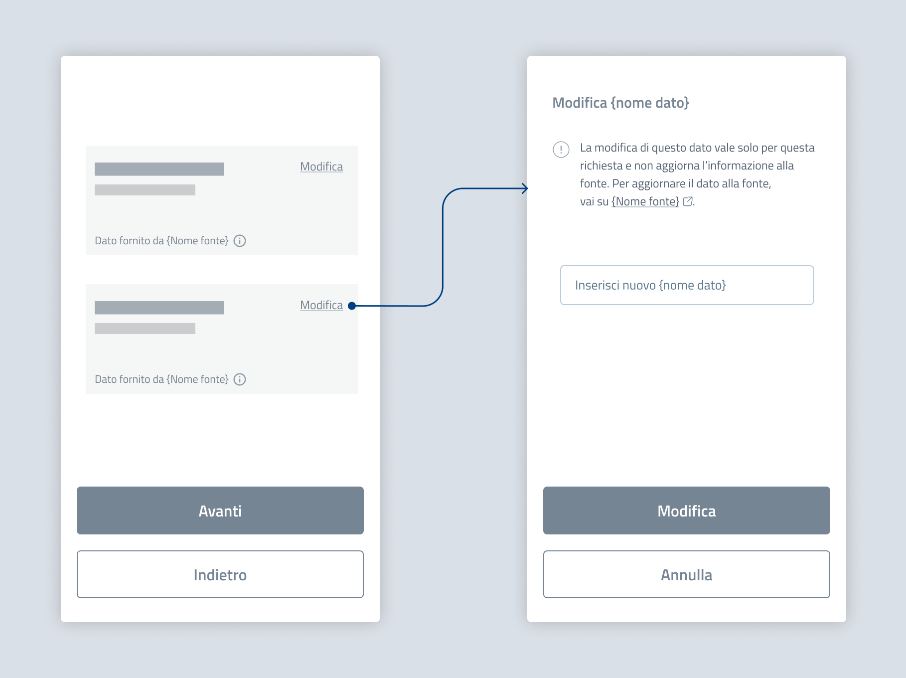

Modifica e rettifica dei dati
===========================================

Quando possibile, consenti al cittadino di modificare i dati recuperati, che potrebbero essere errati. Ogni modifica costituisce autocertificazione ed è limitata alla procedura.  

Suggerisci all’utente come rettificare alla fonte un dato non corretto: fornisci un link al servizio di rettifica o indica l’ente titolare del dato (`vai all’approfondimento: come indicare la fonte e la modalità di rettifica dei dati <../approfondimento-indicare-fonte-e-rettifica>`_).
  

   *Esempio di step di modifica di un dato precompilato.*

.. admonition:: Testo suggerito

   **Modifica {Nome dato}**

   La modifica di questo dato vale solo per questa richiesta e non aggiorna l’informazione alla fonte. Per aggiornare il dato alla fonte, vai su {Nome fonte, con link esterno}. 
