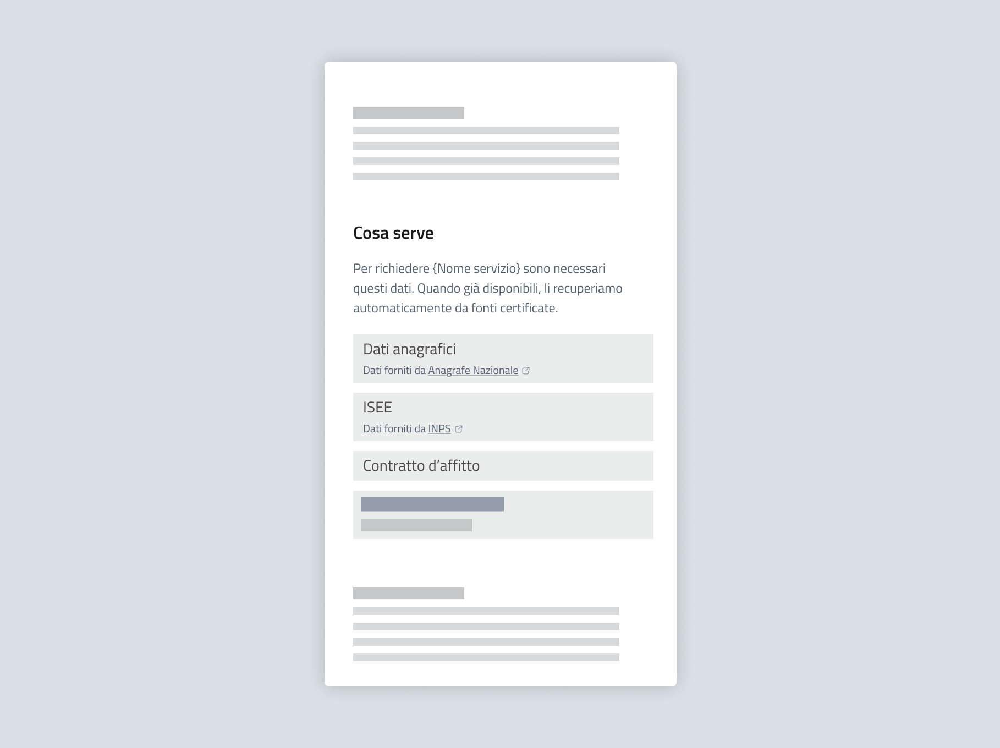

Prima della procedura: scheda di servizio
===========================================

I servizi digitali sono spesso accompagnati da una scheda descrittiva: una pagina sul sito dell'ente che illustra i requisiti di accesso, i documenti necessari e le modalità di fruizione. 

Quando prevista, specifica quali dati verranno recuperati automaticamente, indicandone la fonte. In questo modo il cittadino saprà cosa dovrà fornire e potrà verificare i dati recuperati automaticamente ancora prima di avviare la procedura. 

   *Esempio di presentazione dei dati recuperati tramite interoperabilità nella scheda servizio.*

.. admonition:: Testo suggerito

   Per richiedere {Nome servizio} sono necessari questi dati. Quando già disponibili, li recuperiamo automaticamente da altre fonti certificate. 
