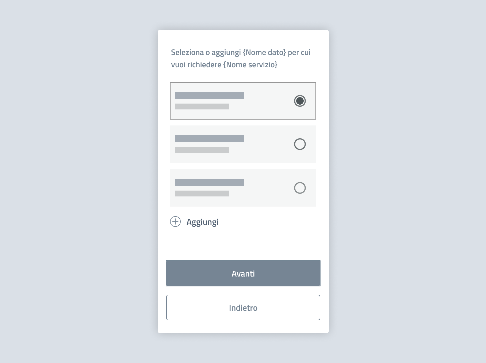

Selezione dei dati
===========================================

Quando le API restituiscono più dati, ad esempio nel caso di più veicoli intestati alla stessa persona, consenti all’utente di selezionare quali utilizzare.  

I dati richiamati tramite API potrebbero non essere completi: permetti all’utente di integrare o aggiungere elementi. 

   *Esempio di step di selezione dei dati.*

.. admonition:: Testo suggerito

   Seleziona o aggiungi {Nome dato} per cui vuoi richiedere {Nome servizio}.

