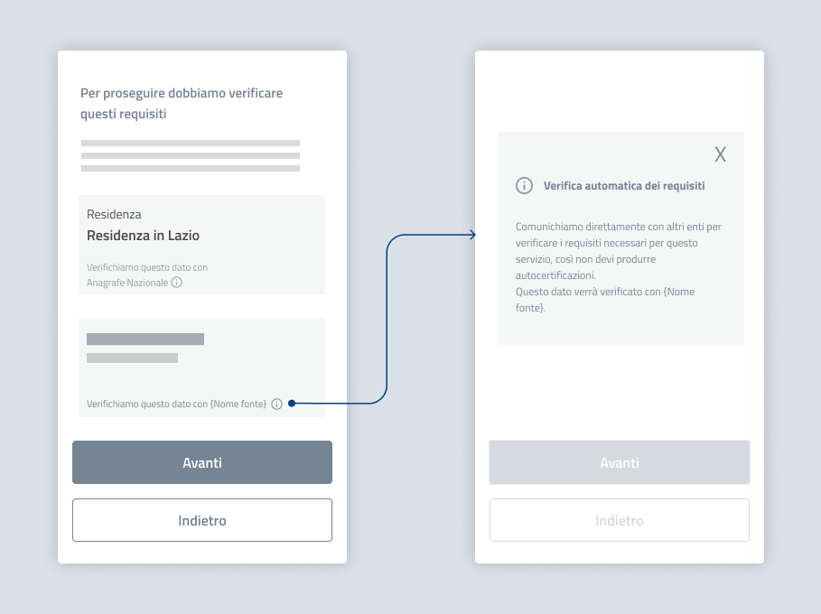
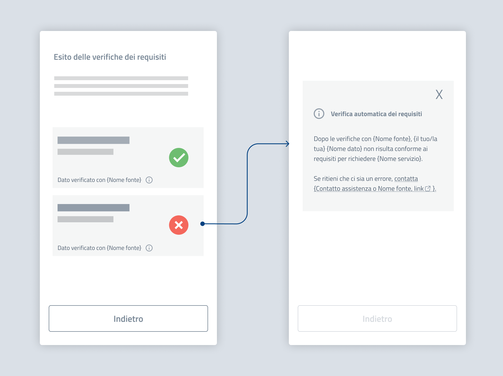

Verifica di un requisito
===========================================

Anche quando utilizzi l’interoperabilità per verificare requisiti di accesso al servizio, ad esempio un bonus o una borsa di studio, informa il cittadino di quali dati sono recuperati automaticamente e indicane la fonte.

Quando possibile, permetti anche agli utenti di approfondire come funziona la verifica dei requisiti, ad esempio tramite tooltip, modale o accordion: potrebbero non ricordare il testo dell'informativa privacy e voler capire come funziona la verifica automatica.
  

   *Esempio di verifica di dati per l’accesso ad un servizio.*

.. admonition:: Testo suggerito per indicare la fonte

   Verifichiamo questo dato con {Nome fonte}

.. admonition:: Testo suggerito per spiegazione di approfondimento

   **Verifica automatica dei dati**

   Comunichiamo direttamente con altri enti per verificare i requisiti necessari per questo servizio, così non devi produrre autocertificazioni. 

Esito della verifica
--------------------------

Quando l’esito della verifica è **negativo**, sia che venga comunicato immediatamente o successivamente tramite canali di ricontatto, comunica chiaramente quale problema è stato riscontrato e offri all’utente canali di assistenza diretto per risolverlo. A seconda delle modalità di gestione del servizio, valuta se fornire il contatto di assistenza del tuo ente o un link all'assistenza dell'ente titolare del dato.

Non fornire canali di assistenza potrebbe precludere l’accesso al servizio.

   *Esempio di feedback dopo la verifica di dati per l’accesso ad un servizio.*

.. admonition:: Testo suggerito
   
   Dopo le verifiche con {Nome fonte}, {il tuo/la tua} {Nome dato} non risulta conforme ai requisiti per richiedere {Nome servizio}.  

   Se ritieni che ci sia un errore, contatta {Contatto assistenza o Nome fonte, link}. 
